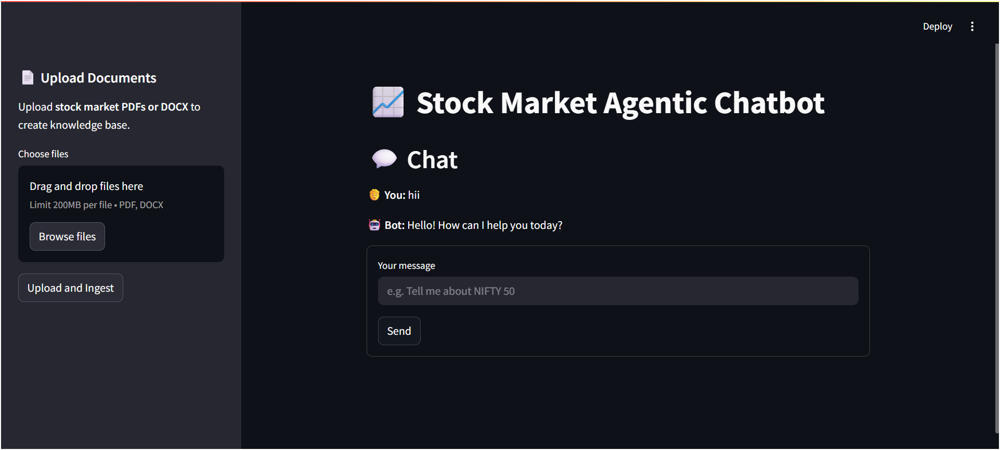

# Agentic‑Trading‑Chatbot: A RAG‑Powered Trading Chatbot

An end-to-end, agentic Retrieval-Augmented Generation (RAG) system designed to deliver data-driven trading insights and automated execution. By combining customer-provided documents, real-time market data, and modular AI agents, this chatbot empowers traders with contextual, actionable intelligence—24/7, at scale.

---

## Here’s a preview of the app’s user interface:


---

## 📂 Repository Structure

```
.
├── .dockerignore
├── .gitignore
├── .python-version
├── Dockerfile.backend        # Dockerfile for building the FastAPI backend
├── Dockerfile.streamlit      # Dockerfile for building the Streamlit frontend
├── ProjectConfig.json        # Project-specific configuration settings
├── README.md                 # Project documentation and usage guide
├── app.py                    # Entry point for the Streamlit Frontend Application
├── config/                   # Directory for configuration files
├── docker-compose.yml        # Docker Compose file for orchestrating backend and ui services
├── main.py                   # Entry point for the FastAPI Backend Application
├── notebook/                 # Jupyter notebooks for exploration and testing
├── requirements.txt          # List of Python dependencies
├── screenshots/              # Directory for storing images used in README
│   └── ui-preview.png        # Screenshot of the user interface
├── setup.py                  # Script for installing the project as a package
├── src/
│   └── trading_bot/          # Main package directory
│       ├── __init__.py
│       ├── components/       # Core business logic and components
│       │   ├── __init__.py
│       │   ├── agents.py     # Definitions of LangChain agents and workflow graph
│       │   ├── data_ingestion.py # Logic for parsing and processing uploaded documents
│       │   └── tools.py      # Implementations of tools (Tavily, Polygon, Retriever)
│       ├── configuration/    # Configuration management classes
│       │   └── __init__.py
│       ├── constants/        # Project-wide constants
│       │   └── __init__.py
│       ├── entity/           # Data entity definitions
│       │   └── __init__.py
│       ├── exception/        # Custom exception handling logic
│       │   └── __init__.py
│       ├── logger/           # Logging configuration and setup
│       │   └── __init__.py
│       ├── pipeline/         # High-level orchestration pipelines
│       │   ├── __init__.py
│       │   ├── data_ingestion_pipeline/ # Pipeline for handling document ingestion
│       │   │   └── __init__.py
│       │   └── query_pipeline/          # Pipeline for handling user queries and RAG
│       │       └── __init__.py
│       ├── schema/           # Pydantic models for request/response and state schemas
│       │   └── __init__.py
│       └── utils/            # Helper functions (I/O, Model loading, etc.)
│           └── __init__.py
└── uv.lock                   # Lock file for ensuring reproducible dependency installs
```

---

## 🔧 Core Workflow

1. **Document Ingestion & Processing**
   Uploads PDFs and DOCX stock market reports (e.g., research notes, earnings transcripts). Documents are parsed, chunked, and preprocessed into text segments.

2. **Vectorization & Indexing**
   Encodes text chunks into embeddings using LangChain and indexes them into Pinecone for low-latency semantic retrieval.

3. **Market Data Retrieval**
   Fetches live market pricing, historical data, and financial indicators via Polygon and Tavily APIs, grounding analysis in up-to-the-minute data.

4. **Agentic Reasoning & Execution**
   Orchestrates multiple AI agents—research, risk assessment, and order execution—through LangChain Agents. Each agent collaborates to generate insights or place simulated trades.

5. **Real-Time Chat API**
   Exposes REST and WebSocket endpoints via FastAPI, running on Uvicorn for sub-200 ms response times under load. Users interact through a Streamlit frontend or API clients.

---

## ✅ Key Capabilities

* **Document-Grounded Trading Insights**
  Answers grounded in your proprietary market research and uploaded documents—strategy analysis, risk factors, earnings summaries, and more.
* **Live Market Data Integration**
  Seamlessly integrates Polygon and Tavily to enrich context with real-time and historical market data.
* **Multi-Agent Automation**
  Modular agents handle distinct tasks (e.g., data retrieval, signal generation, order simulation), enabling complex, coordinated workflows.
* **Production-Ready Best Practices**
  Dockerized services, health checks, structured logging, and metrics (via Prometheus/Grafana) ensure reliability in production environments.
* **Extensible AI Stack**
  Swap LLM providers (Hugging Face, Google GenAI, Groq) or vector backends (Pinecone, AstraDB) with minimal code changes.

---

## 🚀 Deployment & CI/CD

* **GitHub Workflows**
  Automated lint, test, and build pipelines for every commit (`.github/workflows/main.yml`).
* **Docker Hub / AWS ECR**
  Hosts versioned Docker images for both backend (`Dockerfile.backend`) and UI (`Dockerfile.streamlit`).
* **Docker Compose**
  Orchestrates local development with `docker-compose.yml`, defining `backend` and `ui` services, health checks, and inter-service networking.
* **Environment-Driven Configuration**
  Manage secrets and endpoints via a `.env` file:

  ```bash
  POLYGON_API_KEY=your_polygon_key
  TAVILY_TOKEN=your_tavily_token
  PINECONE_API_KEY=your_pinecone_key
  GROQ_API_KEY=your_groq_key
  GOOGLE_API_KEY=your_google_key
  HF_TOKEN=your_huggingface_key
  ```

---

## 🏃 Running Locally

1. **Clone the repository**

   ```bash
   git clone https://github.com/hasan-raza-01/Agentic-Trading-Chatbot.git
   cd Agentic-Trading-Chatbot
   ```

2. **Set up environment variables**

   ```bash
   cp .env.example .env
   # Edit .env with your API keys and endpoints
   ```

3. **Create Virtual environment & Install Python dependencies**

   ```bash
   pip install --upgrade pip uv
   uv venv 
   .venv\scripts\activate
   uv pip install -e .
   ```

4. **Run FastAPI backend**

   ```bash
   uvicorn main:app --host 0.0.0.0 --port 8000 --reload
   ```

5. **Run Streamlit UI**

   ```bash
   streamlit run app.py
   ```

6. **(Alternative) Docker Compose**

   ```bash
   docker-compose up --build
   ```
